# Welcome to HAAIRBNB

Haairbnb is a website clone, inspired by Airbnb. Haairbnb is an online booking app that lets the user listing their house/condo for vacation rentals and tourism activities. Currently, user can create, update, delete and view their listing and also leave a review to other spots (Reservation feature is coming soon.)

It is a fullstack Postgres, Node, React, Redux, CSS application. The majority of the application logic occurs within front end's Redux store and it uses pure css for styling components.

The backend serves the frontend, responds to frontend requests, and fetches data from the Postgres database.

## Table of Contents
* [MVP Feature List](https://github.com/vietha3110/Airbnb/wiki/Feature-List)
* [Database Schema](https://github.com/vietha3110/Airbnb/wiki/Database-Schema)
* [Backend Routes](https://github.com/vietha3110/Airbnb/wiki/API-Endpoints)
* [FrontEnd Routes](https://github.com/vietha3110/Airbnb/wiki/Redux-Store-Shape)

## Tech Stack
*Frameworks, Platforms and Libraries: 

*

*Database
*

*Hosting
*

## Home Page

## Basic Feaures
- Home Page 

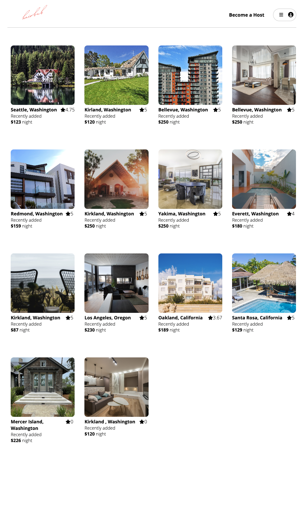

- User Login

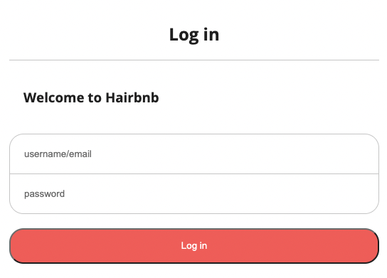

- Sign Up Form 

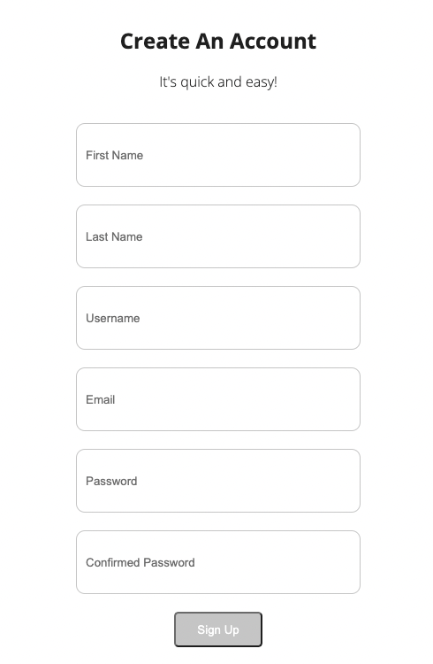

- If visitor(s) do not have an account, do not want to sign up a new account, they can use demo user button inside Profile Button 

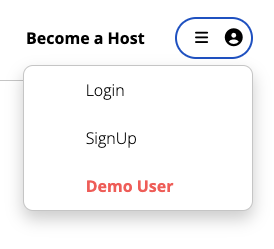

- Profile Button - If user(s) dont login

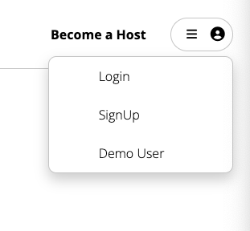

- Profile Button - User login 

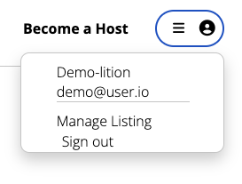

- Spot Detail Page where user can see all the information of the spot(images, info, rating & reviews). Logged in users can leave a review & delete the review they created

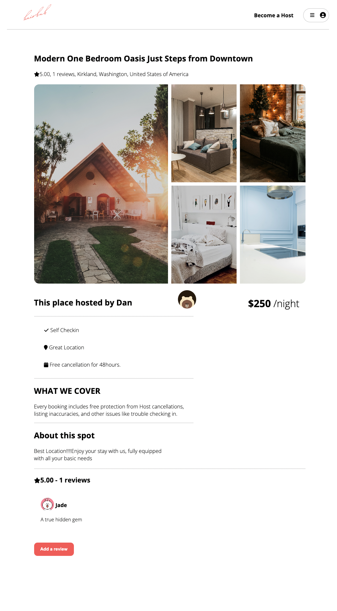

- Add a new review 

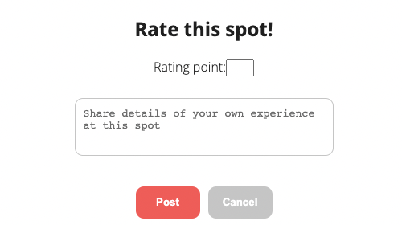

- Delete review: Only user who created the review can see the delete button to remove their review

- Create New Spot 

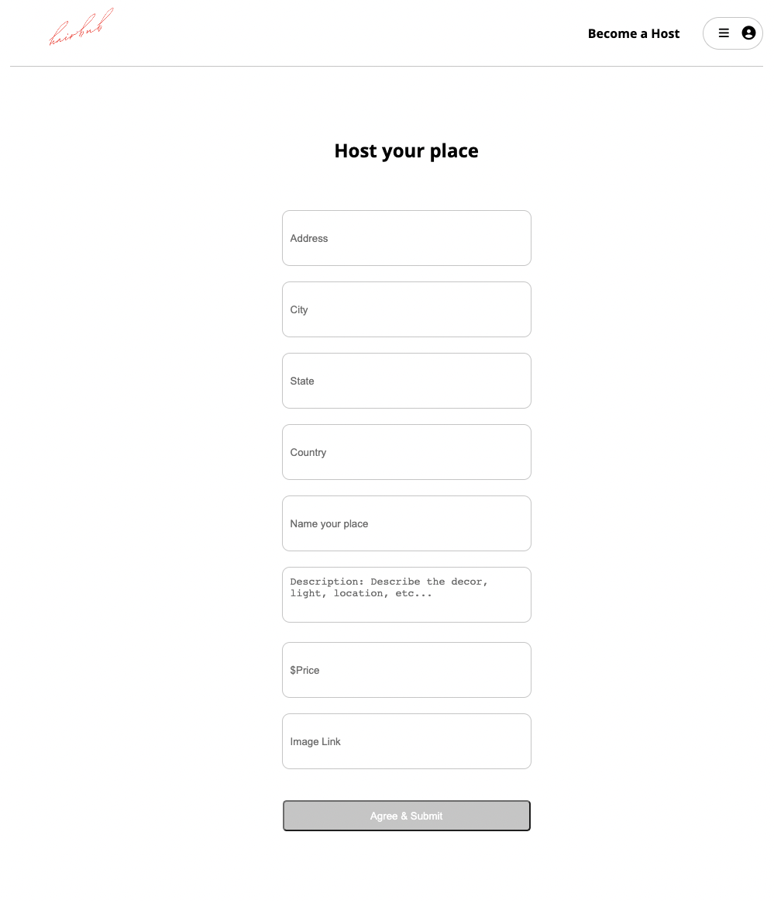

- Manage Spots Listing: 

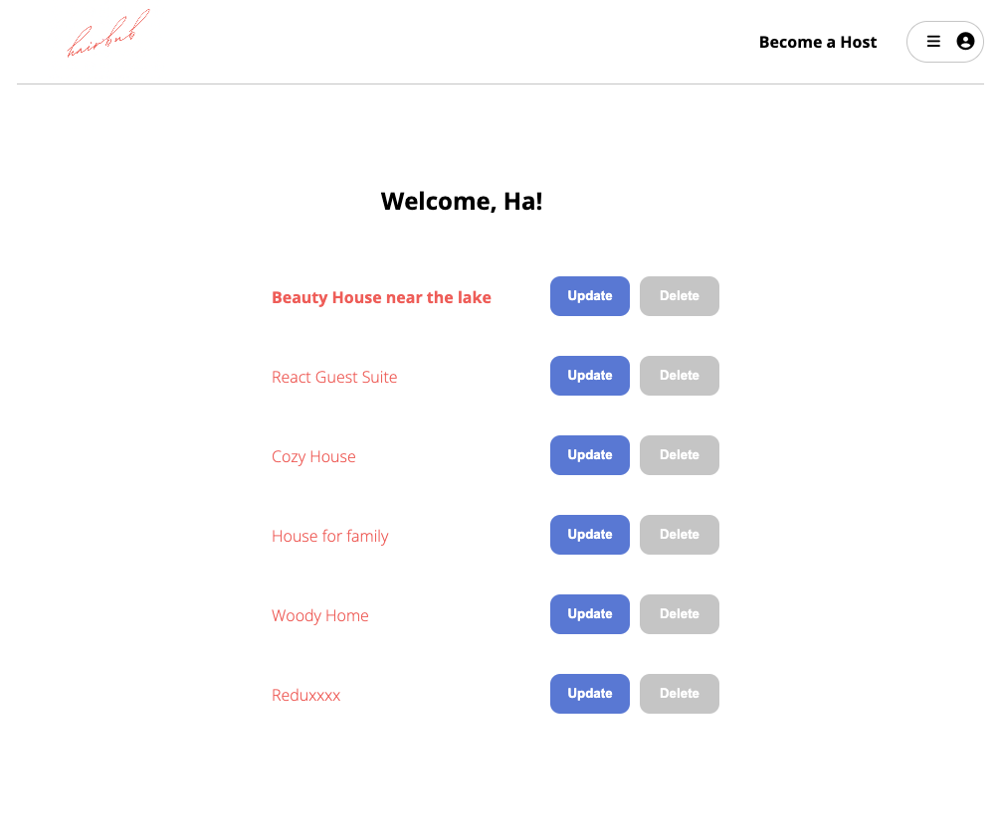

- Update Spot Form: From the manage spots listing, user can click to update button to update their spot information

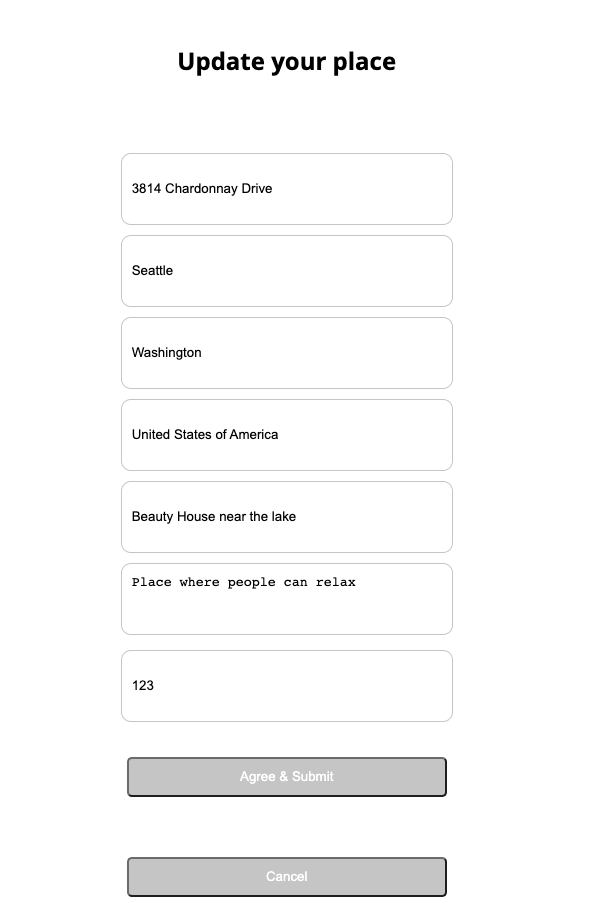

- Delete Spot: From the manage spots listing, user can delete their spot

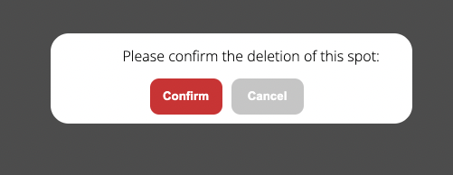

## Contact 
[Ha Nguyen's Linkedin](https://www.linkedin.com/in/havietng/)
